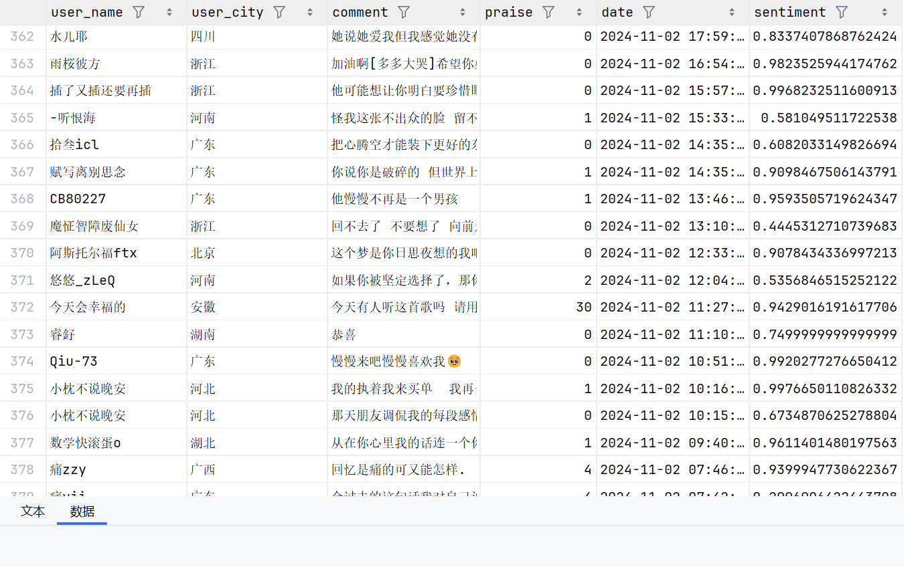
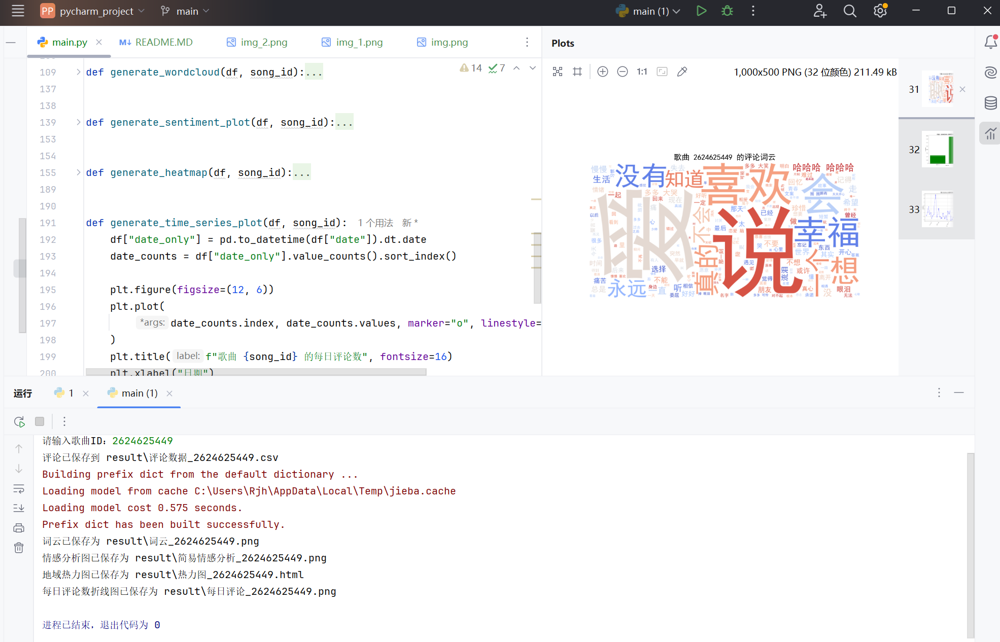
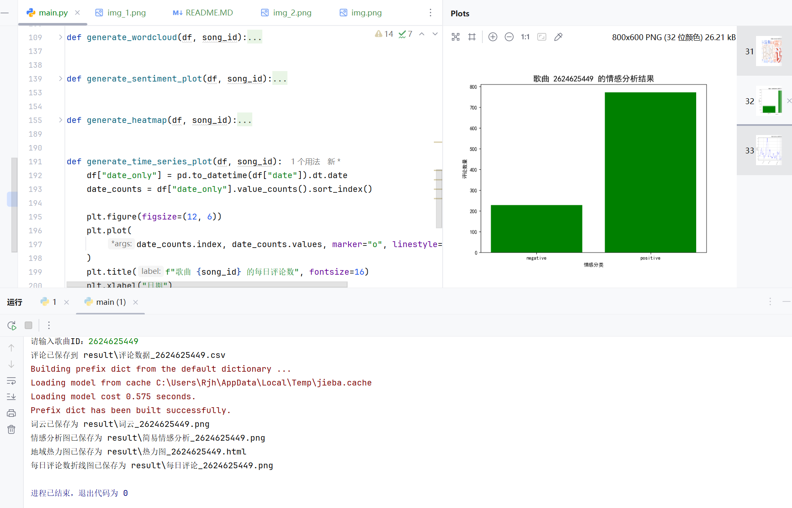
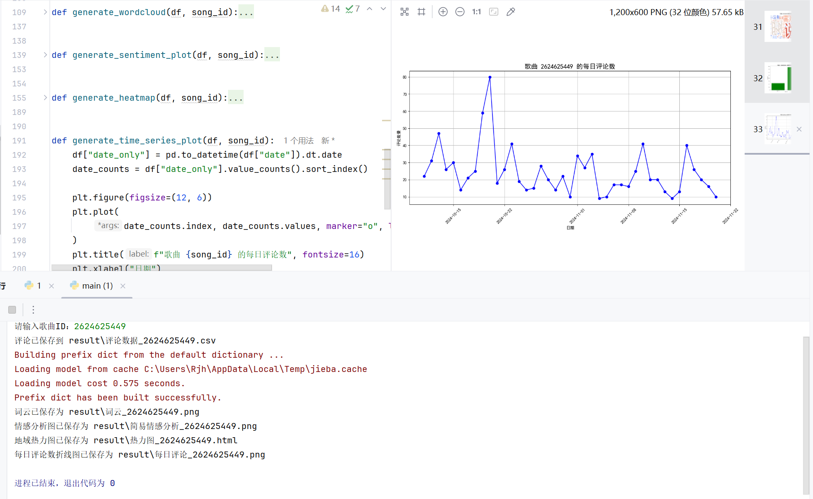
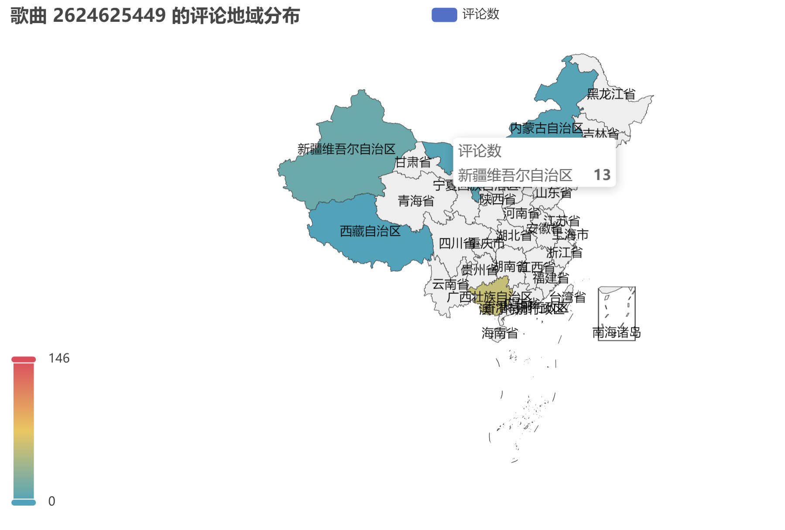

# 网易云音乐评论可视化展示与情感分析

---

## 1.主要功能拓展:
* 功能一:网易云音乐的评论爬取
* 功能二:网易云音乐的评论可视化分析（词云，情感分析，地域热力图，折线图，柱状图）

## 2.安装配置环境
#### 2.1 配置环境
```shell
conda create -n myenv python=3.9
conda activate myenv
pip install -r requirements.txt
```
### 2.2 检查
```shell
pip list
```
---
## 3.运行

### 3.1 获取音乐id


如图音乐id:2624625449

### 3.2 运行结果

---
#### 情感分析结果


---
#### 词云结果


---
#### 情感分析


---
#### 每日评论数

---
#### 地域热力图

